# Rapport détaillé sur les différentes vulnérabilités recensées + comment les corriger 
Les corrections se trouveront sur la branch secure du projet git. 

# Liste de toutes les vulnérabilités que nous avons trouvés 

## 1. Faille XSS 
Nous avons une faille XSS dans cette application web, plus précisément dans la section avis. Pour rappel, une attaque de cross-site scripting (XSS) est une attaque dans laquelle un·e attaquant·e parvient à faire exécuter du code malveillant par un site cible comme s'il faisait partie du site lui-même

### Démonstration XSS

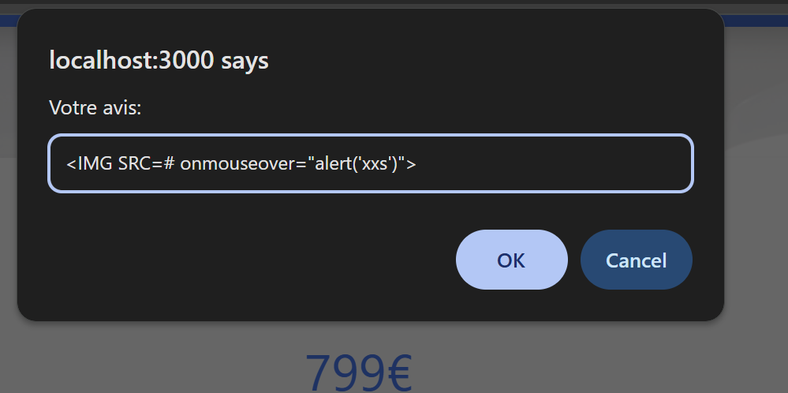 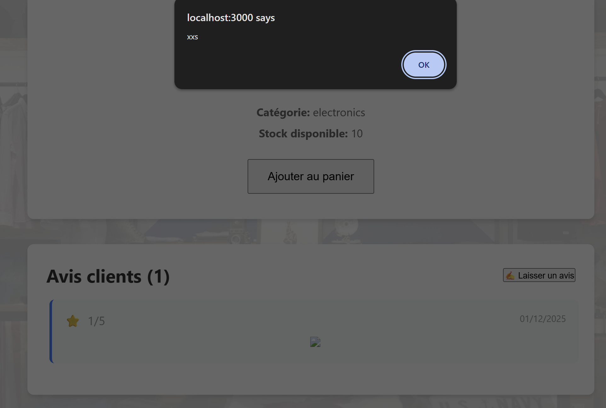
On peut voir ici qu'on a bien exploité la faille. La faille existe car l'application ne filtre ou n'encode pas les entrées utilisateur, ce qui nous permet d'injecter du code javascript malveillant. Nous pouvons faire beaucoup de choses avec les failles XSS : vol de cookies, faire des redirections, modifier une interface etc.

### Ou se trouve cette faille XSS et comment corriger la corriger ?
Plusieurs composants de l’application affichent du contenu utilisateur ou issu de la base de données en utilisant la fonction dangerouslySetInnerHTML. Cette méthode insère directement du code HTML dans le DOM sans aucun filtrage. Il y a également côté backend ou l'avis n'est pas filtré. 

Exemple backend :
```js
app.post('/api/products/:id/review', (req, res) => {
    const productId = parseInt(req.params.id);
    const { rating, comment } = req.body;

    const review = {
        id: Date.now(),
        productId: productId,
        rating: rating,
        comment: comment,
        date: new Date()
    };
``` 
On peut voir qu'il n'y a aucun filtrage

Exemple Frontend :
```js
<div className="product-details-card">
              <h2 dangerouslySetInnerHTML={{ __html: selectedProduct.name }}></h2>
```

Les zones concernées sont :

- L’affichage du nom des produits,

- L’affichage des commentaires/avis utilisateurs,

- L’affichage des détails d’un produit.

Afin de corriger cette vulnérabilité, il suffit de supprimer dangerouslySetInnerHTML partout comme ceci par exemple :

```js
                <div className="review-comment">
                          {review.comment}
                      </div>
```
Il faut également filtrer les commentaires avant de les stocker. Pour se faire nous allons utiliser sanitize-html qui est un module qui permet de le faire.

On l'installe avec 

```powershell
npm install sanitize-html
```

On l'importe
```javascript
const sanitizeHtml = require('sanitize-html');
```
Puis on place ce bout de code dans review 

```js
comment = sanitizeHtml(comment, {
        allowedTags: [],
        allowedAttributes: {}
    })

```
Cela permet de dire qu'on ne veut aucune balise HTML dans le texte. Elles seront transformées en texte brut.

Après retest, la faille XSS a donc été corrigée car quand nous tentons de mettre du code html ça ne met plus rien.

## 2. Injection SQL (Backend)
Il y a également une injection SQL dans cette application web sur la page de connexion. L'injection SQL est une cyberattaque qui consiste à injecter dans une requête SQL des morceaux de codes non filtrés ce qui va permettre à l'attaquant de faire des requêtes non légitimes, comme par exemple se connecter au compte admin sans avoir nécessairement besoin du mot de passe ou afficher la BDD.

### Démonstration SQL
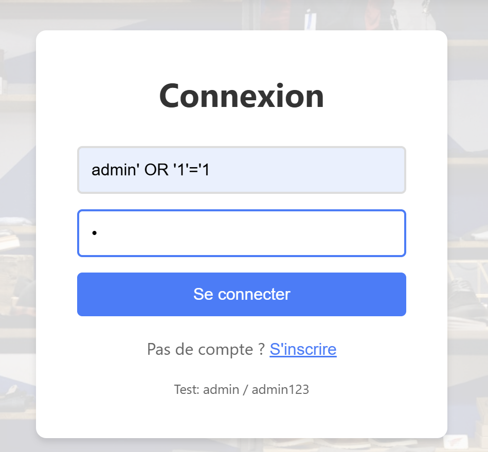 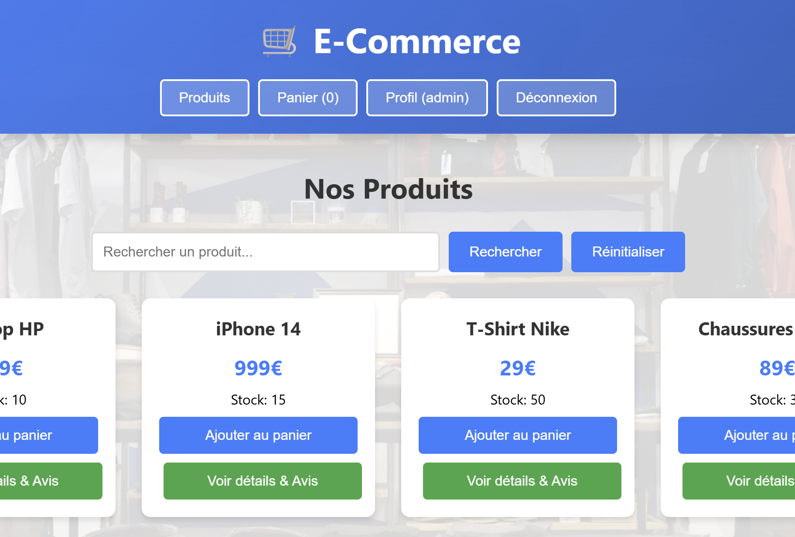
Nous pouvons voir ici que la requête utilisée nous connecte à l’utilisateur admin sans connaître son mot de passe.
L’injection va couper la requête SQL, forcer une condition toujours vraie, puis commenter le reste de la vérification :
```sql
SELECT * 
FROM utilisateurs 
WHERE username = 'admin' OR '1'='1' 
  -- AND password = '1234';
```
La requête injectée permet de se connecter en tant qu’admin sans connaître le mot de passe. En effet, l’expression OR '1'='1' rend la condition toujours vraie, ce qui fait que la base renverra forcément un résultat. Le -- coupe le reste de la requête et transforme la vérification du mot de passe en commentaire. La partie AND password = '1234' n’est donc jamais exécutée. Au final, comme la condition est validée et que le contrôle du mot de passe est ignoré, l’accès est accordé malgré une authentification incomplète.

### Comment corriger la faille SQL dans le code ? 
Pour corriger la faille, il faut supprimer cette ligne dans le code javascript dans la requete post /api/login, ce qui ne va pas authentifier l'user même si le login contient ' OR  '1'='1
```javascript
if (username.includes("' OR '1'='1")) {
    return true;
}
```

## 3. Utilisation de la fonction eval() (Backend) (Frontend)
Dans le frontend et le backend, on peut voir qu'il y a l'utilisation de la fonction eval() qui permet d'exécuter du code Javascript arbitraire. Un utilisateur malveillant peut injecter du code javascript et exécuter n'importe quoi sur le serveur. 

Ci-dessous le code vulnérable dans le backend :

```javascript
app.get('/api/products/search', (req, res) => {
    const query = req.query.q;

    try {
        const searchCode = `db.products.filter(p => p.name.toLowerCase().includes('${query}'.toLowerCase()))`;
        const results = eval(searchCode);
        res.json(results);
    } 
```

Ci-dessous le code vulnérable dans le frontend :
```javascript
const handleSearch = async () => {
    try {
      const filtered = products.filter(p => {
        try {
          return eval(`p.name.toLowerCase().includes('${searchQuery}'.toLowerCase())`);
        } catch(e) {
          return false;
        }
      });
```

### Comment corriger cette faille ?
Pour corriger cette vulnérabilité, il faut éviter d’utiliser eval(), qui exécute du code JavaScript arbitraire.

À la place, on peut utiliser un filtrage simple sur les chaînes de caractères, comme avec filter() et includes(), pour effectuer la recherche sans problème de sécurité.

Méthode correction frontend et backend :

```javascript
const filtered = products.filter(p =>
  p.name.toLowerCase().includes(searchQuery.toLowerCase())
);
```
Cette méthode devrait ainsi permettre de pouvoir rechercher les articles et les filtrer de manière simple et sans utiliser de fonctions dangereuses.

## 4. Version node beaucoup trop ancienne dans les Dockerfile
Dans le dockerfile, la version de nodejs est une version beaucoup trop ancienne, ce qui peut conduire à des problèmes de sécurité potentiels comme des vulnérabilités liés à cette version.
```Docker
FROM node:16
```

### Comment corriger ce problème ? 
Pour corriger ce problème, cela va être très simple. Il suffit simplement de changer la version de nodejs dans le dockerfile de 16 à la version la plus récente/stable ce qui permettra d'améliorer la sécurité de notre environnement. On peut rajouter le -alpine pour qui est une version plus légère que 24.
```Docker
FROM node:24-alpine
```

## 5. Container exécuté en tant que root
Par défaut tous les utilisateurs tournent avec l'utilisateur root, donc si l'application est compromise l'attaquant obtient les accès avec l'utilisateur root sur le système hôte.

### Comment corriger ce problème (Rootless)?
Afin de corriger le problème il suffit simplement de créer un nouvel utilisateur avec le moins de privilèges. Par exemple, on crée un utilisateur nodejs comme ceci :
```Docker
RUN addgroup -g 1001 -S nodejs \
  && adduser -S nodejs -u 1001 \
  && chown -R nodejs:nodejs /app

USER nodejs
```
Cela permettra ainsi de lancer le conteneur avec l'utilisateur nodejs et non root et donc atténuer les risques s'il y a compromission.

## 6. Secrets dans les Dockerfile (JWT, SESSION_SECRET)
Dans les Dockerfile, on peut voir qu'il y a des clés Secrets (jetons JWT...) affichés en clair dans le Dockerfile. 

Dockerfile backend
```Docker
    ENV NODE_ENV=production
    ENV JWT_SECRET=my-super-secret-jwt-key-12345
    ENV SESSION_SECRET=my-session-secret-key
```
Dockerfile frontend
```Docker
    ENV REACT_APP_API_KEY=frontend-api-key-123456
```
C'est problématique les clés secrètes sont en clair donc visible clairement par n'importe qui (si sur Github), il peut y avoir des clés API, mot de passe base de données etc. Un utilisateur malveillant peut donc utiliser les clés secrètes pour pouvoir avoir un accès sur notre base de données par exemple.

### Comment corriger ce problème ?
Pour corriger ce problème, il suffit de faire un fichier .env et d'y insérer toutes les secrets à l'intérieur puis à les changer comme variable d'environnement 

## 7. Secrets en clair dans le backend (Backend)
Dans le code du backend on peut voir que les secrets sont affichés en clair, si la variable d'environnement n'était pas défini, cela prenait une valeur codée en dure, la clé secrète ADMIN_API_KEY était codée en dur :
```javascript
const PORT = process.env.PORT || 5001;

const JWT_SECRET = process.env.JWT_SECRET || "my-super-secret-jwt-key-12345";
const SESSION_SECRET = process.env.SESSION_SECRET || "my-session-secret-key";
const MONGODB_URI = process.env.MONGODB_URI || "mongodb://localhost:27017/ecommerce";
const ADMIN_API_KEY = "admin-key-123456";
```

Cela peut poser des problèmes car n'importe qui peut voir les clés secrètes.

### Comment corriger cette vulnérabilité ? 
Afin de corriger cette vulnérabilité, il suffit simplement de créer un fichier .env et d'arrêter de stocker les valeurs en dur afin de ne pas les laisser visible les secrets :

```javascript
require('dotenv').config();

const app = express();
const PORT = process.env.PORT;

const JWT_SECRET = process.env.JWT_SECRET;
const SESSION_SECRET = process.env.SESSION_SECRET;
const MONGODB_URI = process.env.MONGODB_URI;
const ADMIN_API_KEY = process.env.ADMIN_API_KEY;
```
On charge le fichier .env avec dotenv puis le code va se charger de récupérer les secrets nécéssaire dans le fichier env sans que cela soit visible en clair dans notre code js. On peut également rajouter des vérifications pour vérifier si une variable est bien défini ou non. Sinon ça crée une erreur. Cela permet une vérification avancée et plus de sécurité dans notre code. (Pas utilisé dans la version corrigée car Bug)
```javascript
if (!JWT_SECRET) throw new Error("JWT_SECRET non défini !");
if (!SESSION_SECRET) throw new Error("SESSION_SECRET non défini !");
if (!MONGODB_URI) throw new Error("MONGODB_URI non défini !");
if (!ADMIN_API_KEY) throw new Error("ADMIN_API_KEY non défini !");
```

# 8. IDOR (Insecure Direct Object Reference) (Backend)
Une vulnérabilité de type IDOR est un problème de contrôle de droits, qui apparait lorsqu’une référence directe à un objet (fichiers, informations personnelles, etc.) peut être contrôlée par un utilisateur.

Cette vulnérabilité se trouve ici dans le backend :
```javascript
app.post('/api/checkout', (req, res) => {
    const { userId, productId, quantity, creditCard } = req.body;

    const product = db.products.find(p => p.id == productId);

    if (!product) {
        return res.status(404).json({ message: 'Produit non trouvé' });
    }

    if (product.stock >= quantity) {
        product.stock -= quantity;

        const order = {
            id: db.orders.length + 1,
            userId: userId,
            productId: productId,
            quantity: quantity,
            total: product.price * quantity,
            creditCard: creditCard,
            date: new Date()
        };
```
La raison est que nous faisons confiance au client pour envoyer l'ID utilisateur, ce qu'il ne faut surtout pas faire.

### Demonstration 
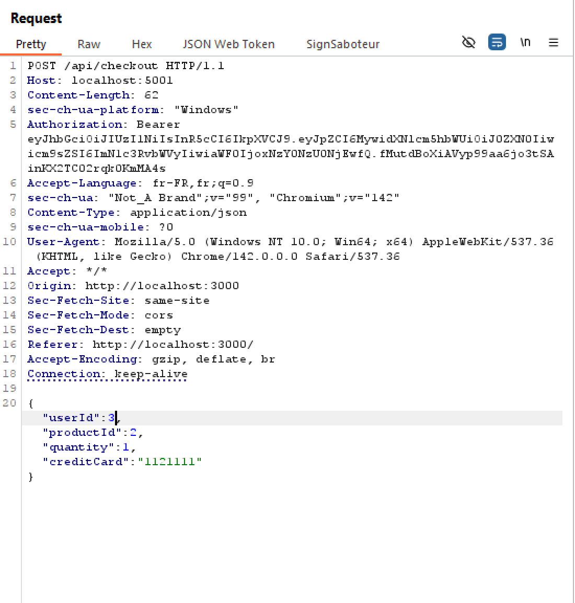
Ici on peut voir une requête POST qui permet de payer un article qui est dans le panier. On peut voir quelque chose d'intéressant le "UserId":3. Le UserId correspond à l'identifiant de notre compte utilisateur, ici c'est 3 (Par exemple, le compte Admin peut être 1). Essayons de modifier l'userId en 1.
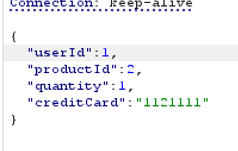

Envoyons la requête pour voir le résultat :
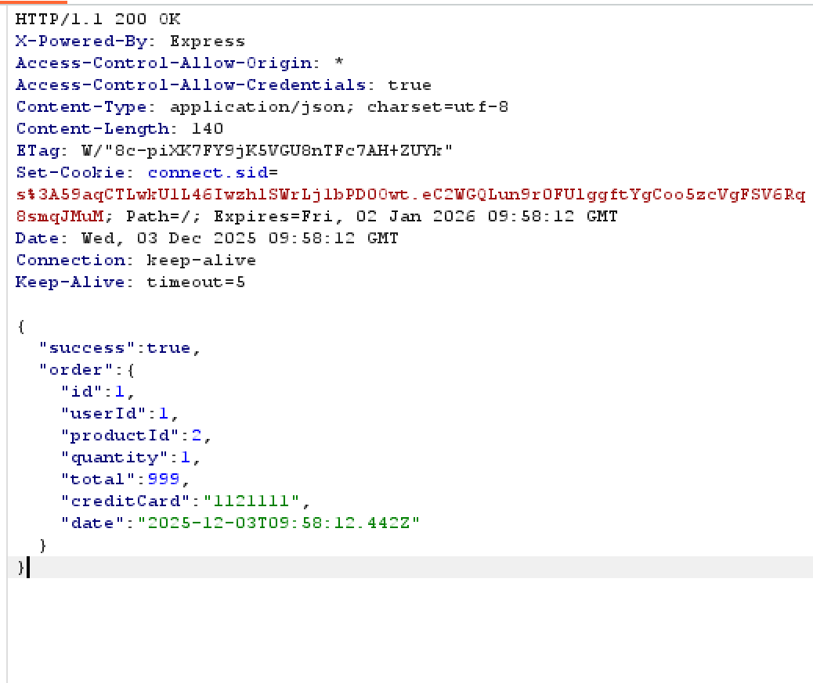
On peut voir que l'on a bien effectué une commande avec l'UserId 1. C'est donc une IDOR.

### Pour est-ce grave et comment la corriger ?
IDOR est particulièrement grave car nous pouvons effectuer des requêtes sous un autre utilisateur. L'exemple ci-dessus nous permettait d'effectuer des commandes sous un autre user. Mais on peut faire pire, comme accéder à des ressources non autorisée, ou modifier des informations personnelles avec un UserId tel que des mots de passes ou autre.

Afin de corriger cela, il suffit d'ignorer le userId envoyé par le client et d'utiliser celui provenant du token JWT.

```javascript
app.post('/api/checkout', (req, res) => {
    const { productId, quantity, creditCard } = req.body;

    const { userId } = req.user.id;

    const product = db.products.find(p => p.id == productId);

    if (!product) {
        return res.status(404).json({ message: 'Produit non trouvé' });
    }

    if (product.stock >= quantity) {
        product.stock -= quantity;

        const order = {
            id: db.orders.length + 1,
            userId,
            productId,
            quantity,
            total: product.price * quantity,
            creditCard: creditCard,
            date: new Date()
        };
```

Ici on utilise donc l'user id qui provient de la session JWT et non de la requête.

# 9. Possible de s'inscrire avec le même nom d'utilisateur et même email plusieurs fois (Backend + Frontend)
Dans le backend, nous pouvons voir qu'il est possible de s'inscrire plusieurs fois avec le même nom d'utilisateur et le même email, ce qui devrait normalement ne pas être possible :
```javascript
app.post('/api/register', (req, res) => {
    const { username, password, email } = req.body;

    const newUser = {
        id: db.users.length + 1,
        username: username,
        password: password,
        email: email,
        role: 'customer'
    };
```
### Comment corriger cette vulnérabilité ?
Afin de corriger cela, il suffit simplement de mettre une vérification, si le nom d'utilisateur ou l'email existent déjà dans la base de données alors le compte de ne peut pas être créé.
```javascript
const existingUser = db.users.find(
        u => u.username === username || u.email === email
    );

    if (existingUser) {
        return res.status(400).json({
            success: false,
            message: 'Nom d’utilisateur ou email déjà utilisé'
        });
    }
```
Maintenant, si on essaye de se créer un compte avec un nom d'utilisateur ou un mot de passe déjà existant, cela causera une erreur.
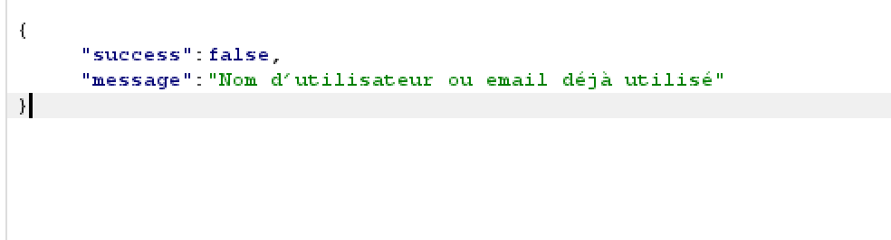

**Correction frontend**
Il reste également à corriger cette vulnérabilité sur le frontend car même si la requête renvoie une erreur 400, cela affiche tout de même inscription réussie côté client.

```js
if (!data.success) {
        alert(data.message);
        return;
      }
```
Il suffit simplement de rajouter cette ligne de code dans le App.js dans la partie register. Et cela va donc nous permetttre d'afficher une erreur si l'utilisateur est déjà créé.

Exemple :

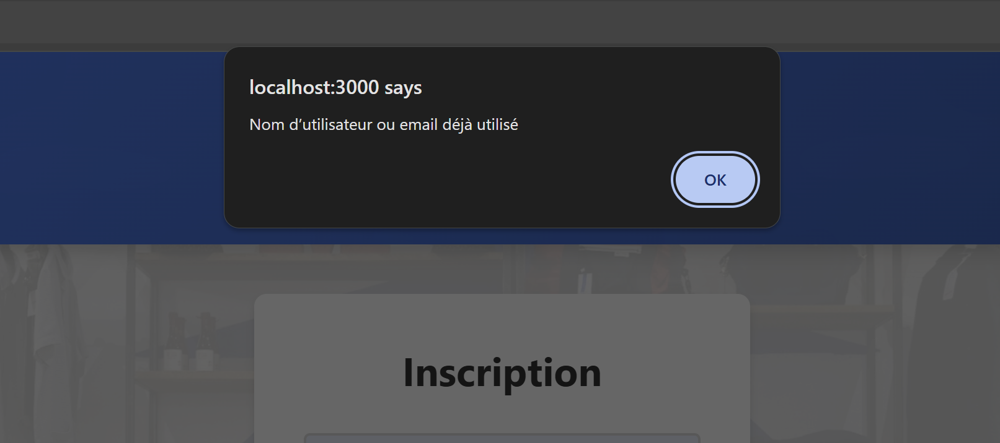

On peut donc voir que l'inscription n'aboutit pas car le nom d'utilisateur ou l'email est déjà utilisé.

## Endpoint critique
L'endpoint /api/debug est un endpoint critique car il nous permet d'avoir énormément d'informations tel que :
- La version de node utilisé
- Les secrets JWT et session
- La database entière avec la liste des users etc.

### Démonstration
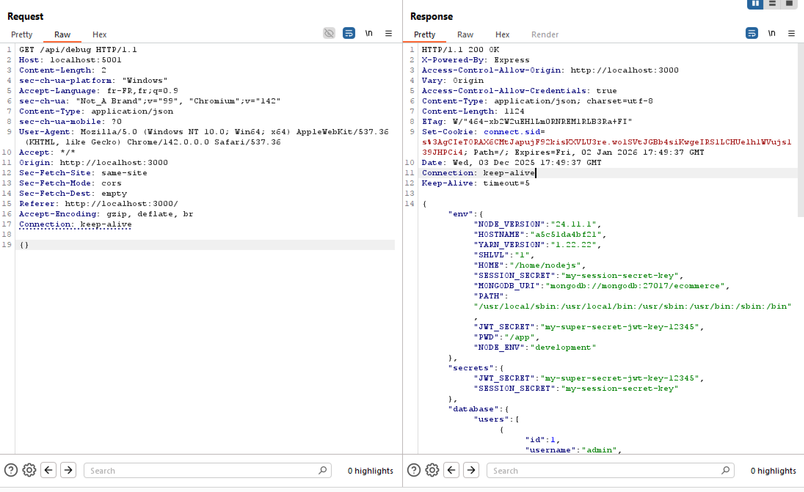
Ici on fait un GET sur /api/debug. On peut ainsi voir qu'on a accès à l'intégralité des informations de notre serveur web (les versions utilisés, les databases...).


### Comment corriger cette vulnérabilité ?
Cet endpoint est donc grave, il faut le retirer, ou bien mettre une sorte d'authentification afin de pouvoir GET. On peut également debug en utilisant la console serveur (long mais sécurisé). Pour ma part nous allons tout simplement retirer cet endpoint par précaution.

# 10. Mot de passe stockés en clair dans la base de données.
Dans le code, on peut apercevoir que les mots de passes de la base de données sont stockés en clair.

```js
const newUser = {
        id: db.users.length + 1,
        username: username,
        password: password,
        email: email,
        role: 'customer'
    };
```


Pourquoi c'est critique ?
- Un attaquant qui obtient l'accès à la base voit tous les mots de passe.
- Un employé interne aussi.
- Aucun respect des bonnes pratiques de sécurité tels que OWASP ou le RGPD.

## Comment corriger cette vulnérabilité ?
Afin de corriger cette vuln, il suffit simplement de hasher les mots de passe avant de les stocker dans la base de données. Pour cela on peut utiliser bcrypt qui permet de hasher les mots de passe.

```powershell
npm install bcrypt
```
Ensuite on importe le module bcrypt dans notre fichier 
```js
const bcrypt = require('bcryptjs');
```

Une fois cela fait, on hash crée une variable hashedPassword et on applique à un hash au mot de passe que l'utilisateur aura rentré :
```js
const hashedPassword = await bcrypt.hash(password, 10);

    const newUser = {
        id: db.users.length + 1,
        username: username,
        password: hashedPassword,
        email: email,
        role: 'customer'
    };

    db.users.push(newUser);
```

Précision : le 10 correspond à la complexité du hash.
Ensuite, au lieu d'enregistrer le mot de passe normal, on enregistre la version hashé.

Une fois cela fait, il suffit de vérifier dans /api/login, que le mot de passe que l'utilisateur a rentré correspond au hash du mot de passe de l'utilisateur.

```js
app.post('/api/login', async (req, res) => {
    const { username, password } = req.body;

    const query = `username = '${username}' AND password = '${password}'`;

    const user = db.users.find(u => u.username === username);
    
    if (!user) {
        return res.status(401).json({
            success: false,
            message:'Identifiants incorrects'
        })
    }
    const compare = await bcrypt.compare(password, user.password);
```
Ici, on vérifie si le mot de passe fourni par l’utilisateur correspond au mot de passe hashé stocké dans la base de données. Si la comparaison est réussie, l’utilisateur est authentifié. 

# 11. Le backend autorise l'usage de mots de passe faibles au moment de l'inscription (Backend)
Au moment de l'inscription, nous pouvons mettre des mots de passe très faible (8 caractères ou moins). C'est une faille réelle et on appelle cela le Weak password policy.

**Pourquoi est-ce grave ?** : Cette faille peut typiquement mener à du bruteforce et donc la compromission de comptes utilisateur car les mots de passe seront facile à deviner.

### Comment corriger cette vuln ?
Pour corriger cette vuln, c'est assez simple. Il suffit simplement de mettre une vérification au moment de l'inscription de l'utilisateur. Par exemple, si l'utilisateur entre un mot de passe dont la longueur est inférieure à 8 caractères, ça retourne une erreur.

```js
if (password.length < 8) {
        return res.status(400).json({
            success: false,
            message: 'Mot de passe trop court ! Merci dutiliser un mot de passe de 8 caractères minimum'
        })
    }
```
Ci-dessus, nous pouvons voir que nous avons bien mit une vérification qui permet de retourner une erreur 400 si l'user met un mdp trop court.

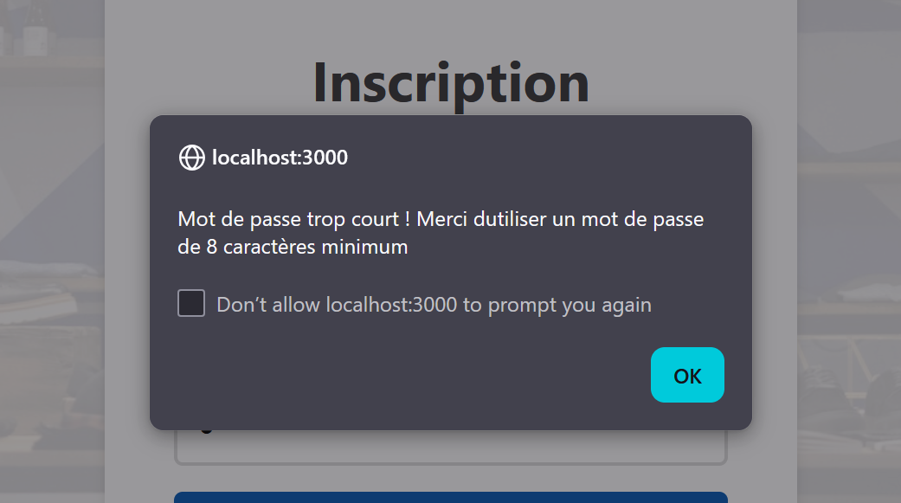

La vérification marche bien. Pour améliorer ceci on peut également exiger minimum un caractère special dans le mot de passe et une majuscule par exemple !

# 12. Affichage de credentials dans la page de login
Dans la page de login, on peut voir la mention "Test:admin / admin123" qui est le nom d'utilisateur de l'admin ainsi que son mot de passe. Il ne faut jamais afficher des identifiants en clair que ce soit dans le code source de la page ou dans la page directement

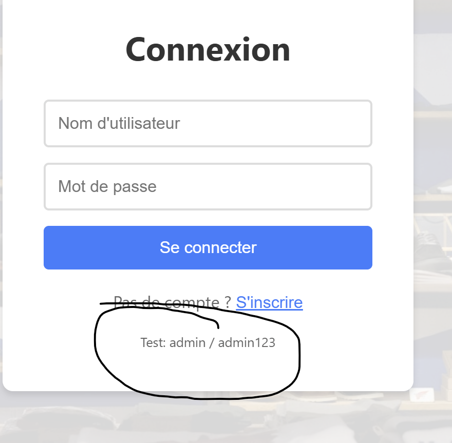

### Comment corriger ? 
Pour corriger cela, il suffit simplement de supprimer ceci et de ne jamais mettre de creds en clair sur les pages ou autre.

```js
<p style={{fontSize: '0.8em', color: '#666'}}>
              Test: admin / admin123
            </p>
```
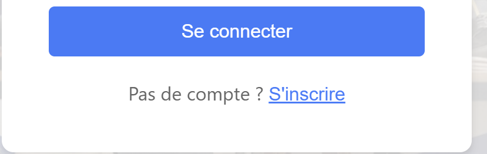
Nous avons supprimé cette ligne.

# 13. Endpoint /api/users qui permet de voir la liste des utilisateurs
Il y a l'endpoint /api/users qui nous permet de voir la base de données entière avec tous les utilisateurs, testons une requête GET sur cet endpoint :
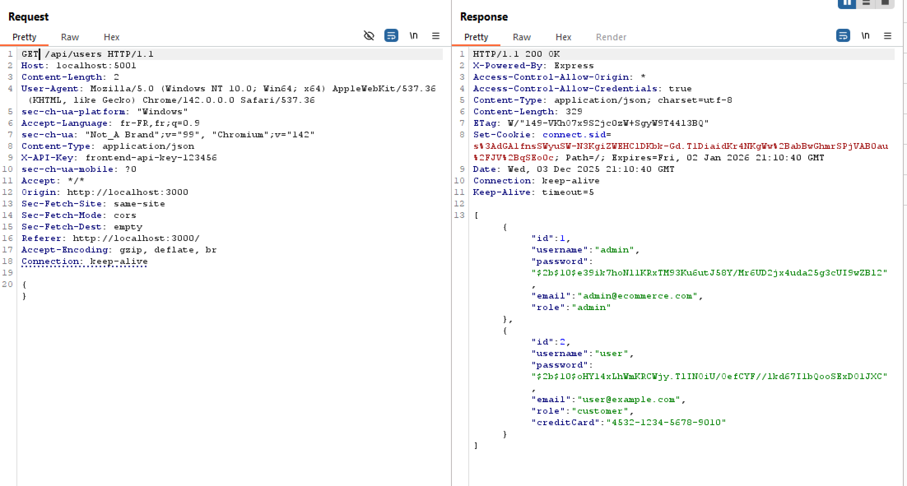
On peut voir que n'importe qui peut y accéder, je n'étais même pas connecter. Il faut donc supprimer /api/users pour une question de sécurité.

# 14. Aucune vérification dans /api/admin/stats
Sur la route /api/admin/stats, nous pouvons voir que nous pouvons voir les statistiques que seul l'admin est censé voir alors que nous ne sommes pas authentifié.
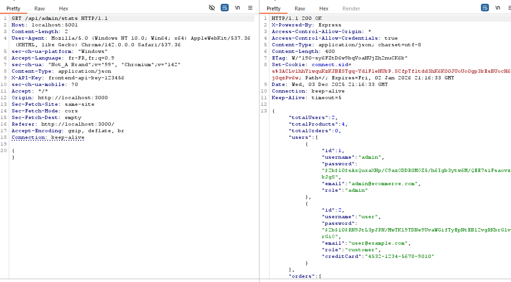

Ceci est très grave car si un utilisateur non légitime arrive a GET cet endpoint, il récupèrera toutes les informations sur les utilisateurs tel que les emails, leur rôles etc.

### Comment corriger cette vulnérabilité ?
Afin de corriger cette vulnérabilité, il suffit simplement d'ajouter une vérification avec plusieurs middleware.

**Pour rappel :** Un middleware est une fonction qui s'exécute avant la route, il est placé au milieu entre la requête du client et la route finale, il peut donc accepter ou bloquer la requête.

Tout d'abord installons le module jsonwebtoken :
```powershell
npm install jsonwebtoken
```

```js
function requireAuth(req, res, next) {
    const header = req.headers.authorization;

    if (!header) {
        return res.status(401).json({ message: 'Token manquant' });
    }

    const token = header.split(" ")[1];

    try {
        const decoded = jwt.verify(token, JWT_SECRET);
        req.user = decoded;
        next();
    } catch (e) {
        return res.status(401).json({ message: 'Token invalide' });
    }
}

function requireAdmin(req, res, next) {
    if (req.user.role !== 'admin') {
        return res.status(403).json({ message: "laccès est interdit (admin uniquement)" });
    }
    next();
}
```
Ci-dessus, la première fonction permettra de vérifier si un user est connecté ou non en prenant son token jwt.

La deuxième fonctione permettra elle de vérifier si l'utilisateur est un admin. Si non une erreur 403 est retournée.

Maintenant on met deux middleware entre notre route /api/admin/stats : 
```js
app.get('/api/admin/stats', requireAuth, requireAdmin, (req, res)
```
Comme ceci, maintenant essayons de faire une requête vers /api/admin/stats sans être authentifié :
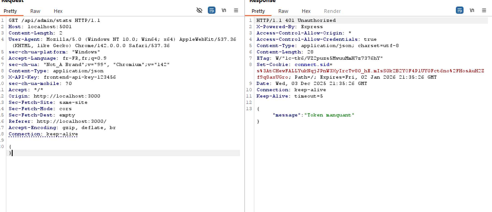
On peut voir que ça nous retourne un message d'erreur car nous ne sommes pas connectés. 
Maintenant essayons avec un user non admin.
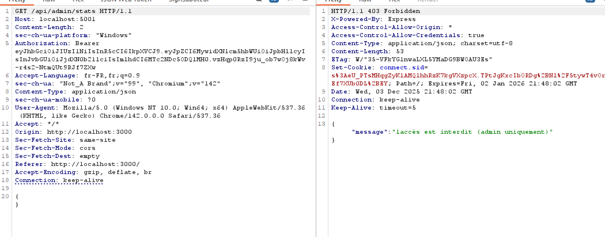
Accès interdit car l'user n'est pas admin. Notre middleware fonctionne parfaitement. 
L'user admin lui est toujours autorisé à se connecter donc tout fonctionne ! 

# 15. Vulnérabilités dans les modules npm
Nous pouvons voir des vulnérabilités dans les modules npm. Pour voir en détail il suffit simplement d'utiliser la commande
```powershell 
npm audit
```
Ensuite on a tous les modules vulnérables ainsi que la description des vulnérabilités et leur version. Ici nous en avons 18 dans notre cas (5 low, 7 modérée, 5 élevées et 1 critique)

### Comment corriger cela ?
Afin de corriger cela, il suffit de taper la commande 
```powershell
npm audit
```
